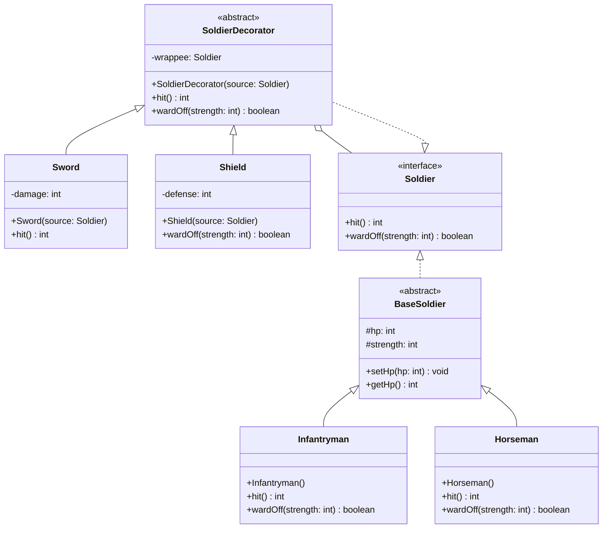

# Army Game

## Decorator Pattern

### Class Diagram



### Theo Decorator Pattern, "chức năng của đối tượng trở nên phong phú hơn" – điều này có đúng không?

Có. Decorator Pattern làm cho hành vi của binh lính trở nên phong phú hơn bằng cách mở rộng chức năng của đối tượng mà không cần sửa đổi lớp gốc.

Ban đầu một binh lính chỉ có hai hành động:

- `hit()`
- `wardOff()`

Sau khi áp dụng Decorator, các trang bị như `Sword` và `Shield` có thể thay đổi hành vi của các phương thức này.

Ví dụ:

- `Sword` làm tăng sức mạnh tấn công của `hit()`
- `Shield` làm tăng khả năng phòng thủ trong `wardOff()`

Một soldier có thể được trang bị nhiều decorator:

```java
Soldier s =
    new Sword(
        new Shield(
            new Infantryman()
        )
    );
```

Chuỗi gọi phương thức sẽ là:

```
Sword.hit()
 -> Shield.hit()
     -> Infantryman.hit()
```

Nhờ vậy hệ thống có thể tạo ra nhiều biến thể hành vi khác nhau trong runtime.

Điều này tuân theo nguyên lý **Open-Closed Principle** – tức là mở rộng hành vi của đối tượng mà không cần sửa đổi mã nguồn hiện có.

### Nếu có thêm ràng buộc: một binh lính không thể mang hai trang bị cùng loại – Decorator có phù hợp không?

Không. Decorator Pattern không phải là phương pháp thích hợp để đảm bảo ràng buộc này.

Decorator cho phép các decorator được lồng vào nhau một cách tự do. Ví dụ hệ thống vẫn cho phép:

```java
Soldier s =
    new Sword(
        new Sword(
            new Infantryman()
        )
    );
```

Điều này dẫn đến việc một binh lính có thể mang hai thanh kiếm, điều mà yêu cầu mới không cho phép.

Decorator Pattern chỉ giải quyết việc mở rộng hành vi của đối tượng, chứ không kiểm soát các ràng buộc logic giữa các decorator.

Do đó, Decorator phù hợp để mở rộng hành vi, nhưng không phù hợp để đảm bảo các ràng buộc như "không được trang bị hai vật phẩm cùng loại".
